# generator-springbootms
A ClI based tool to generate fully functional spring-boot microservices. 
Its based on Yeoman tool for CLI interpretation.

## How to use?

```
> npm install -g yo
> npm install -g generator-springbootms
> yo springbootms
```

## Local Development Setup

```
> git clone https://github.com/amareshk8/api-generator.git
> cd generator-springbootms
> npm install 
> npm link
> yo springbootms
```

## Generate Endpoints withing services

``` 
> cd MyService
> yo springbootms:endpoint entityname --base-path /path
```

## Features

1. Microservice

    * SpringBoot REST API with jar type packaging.
    * CORS configuration
    * Swagger UI Integration
    * Spring Data JPA integration with option to select databases like MySQL, Postgresql, MariaDB etc
    * Flyway or Liquibase data migration support
    * SpringBoot Actuator configuration
    * Integration with Config Server, Service Registry, Sleuth, Zipkin
    * TestContainers integration(Local Docker Setup is mandatory)
    * JUnit 5 
    * Docker configuration for Application, ELK, Prometheus, Grafana
    * Jenkinsfile,TravisFile,
    * manifest.yml for PCF deployment.
    * Dockerfile for service.

2. Spring Cloud Config Server

    * Config Server with Git and native backend configuration

3. Service Registry

    * Service Registry based on Netflix Eureka
    
## Why another generator when you have JHipster?
JHipster is an amazing SpringBoot application generator with lots and lots of cool features.
However, there are certain JHipster features that does not fit for my preferences such as:

1. I like *jar* packaging
2. I like to use spring-boot-starter-* than configuring individual libraries
3. I like to have an option to generate application without spring-security
4. I prefer Flyway over Liquibase
5. I like to have only minimum and required configuration ie no AsyncConfiguration, LocaleConfiguration, CacheConfiguration, Logstash Logging etc.
6. I like .properties over .yml    

### Main Menu

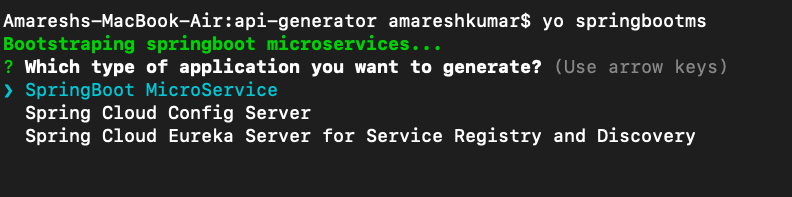

### Generate SpringBoot Microservice

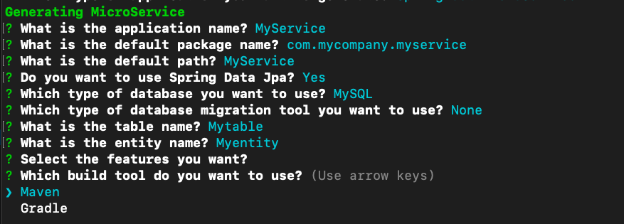

### Genrated File
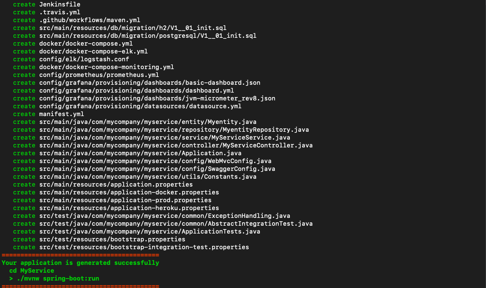


### Generate REST API with CRUD operations
You can generate REST API with CRUD operation using the following command:

:high_brightness: You should run the following command from within the generated project folder. 

The command to generate endpoints and subsequent file is "yo springbootms:endpoint entityname --base-path path"

eg. `MyService> yo springbootms:endpoint Customer --base-path /api/customers`

This will generate:
* JPA entity
* Spring Data JPA Repository
* Service
* Spring MVC REST Controller with CRUD operations
* Unit and Integration Tests for REST Controller
* Flyway or Liquibase migration to create table

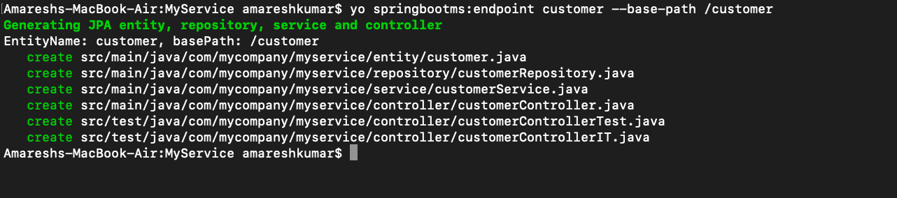

### FolderStructure of generated services
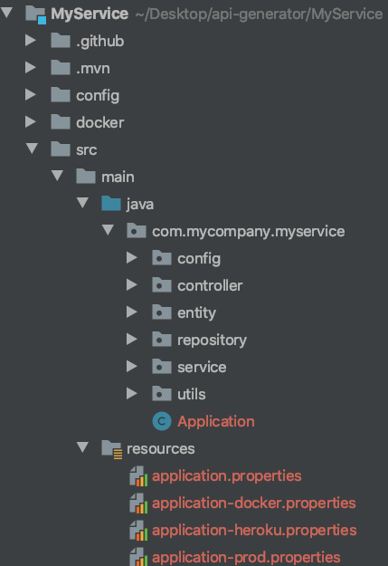

### SampleFiles of generated services
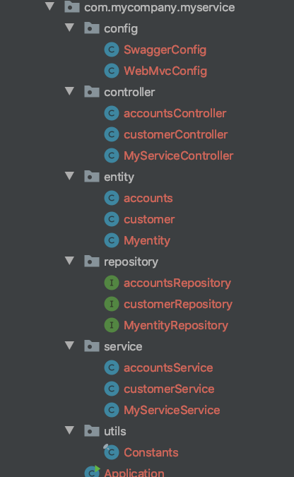

### Sample config Files of generated services
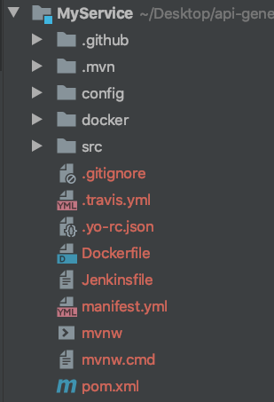

### Dockerfile
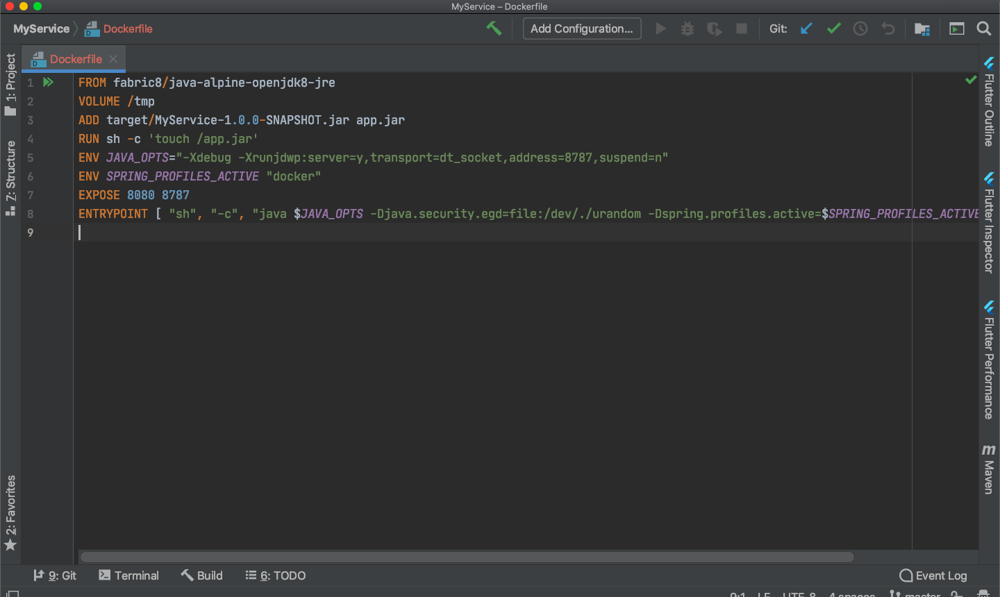

### PCF Manifest file
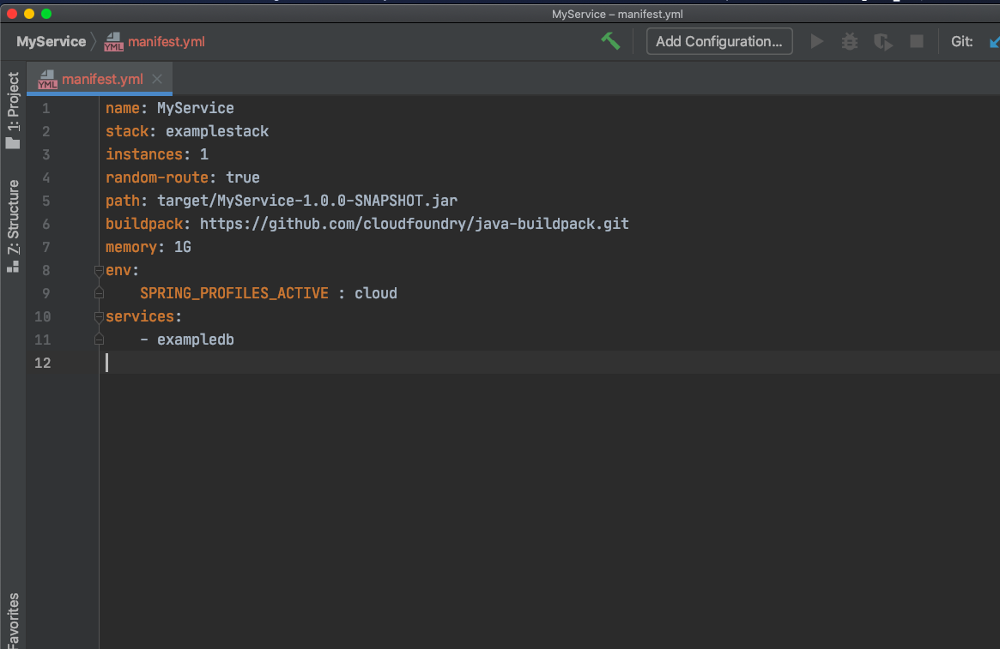

### Jenkinsfile
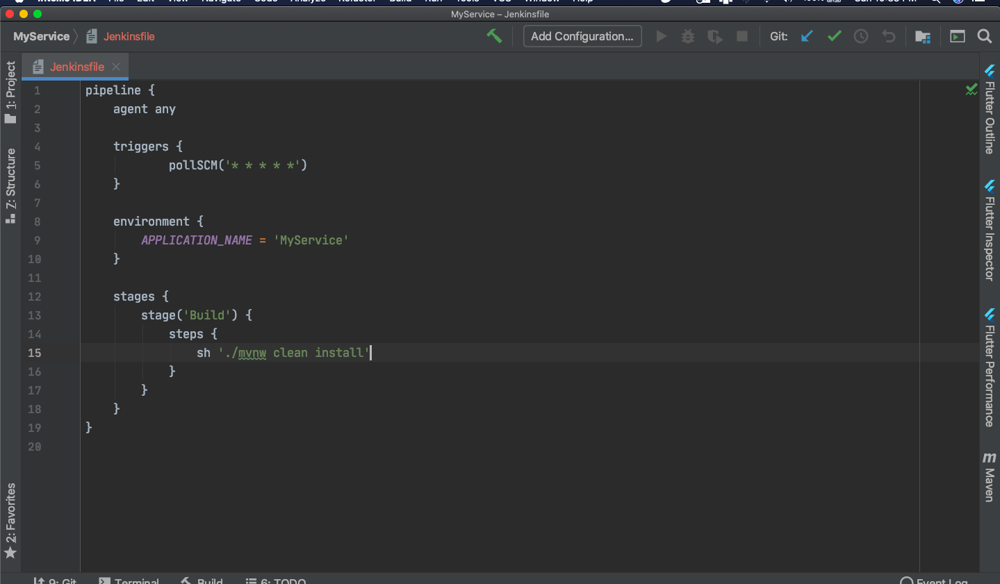

### FolderStructure of generated services


### Sample controller
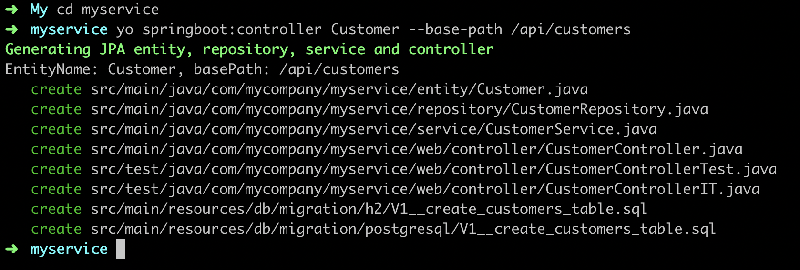
